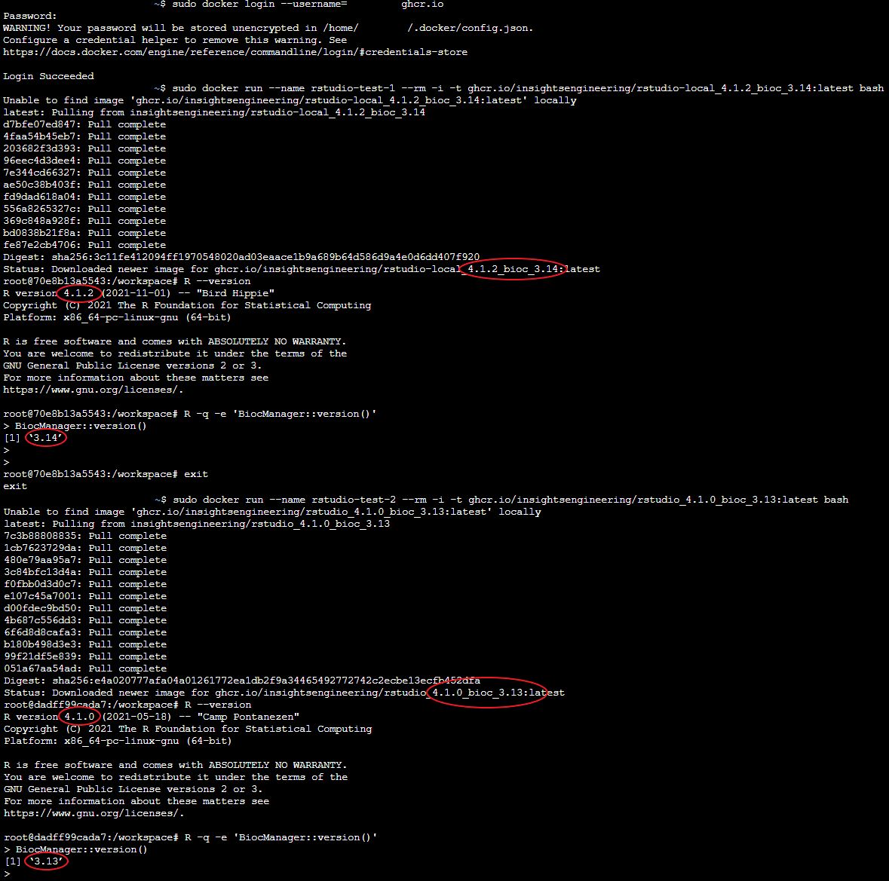

# Docker Images for CI

Docker images that will be used for CI purposes via GitHub Actions.

## How it works

There is a [`Dockerfile`](./Dockerfile) available at the base of this repository which is designed to accept built-time `ARG`uments based such as the R version, BioConductor version, and the original distribution on which the image is based on.

The [`scripts`](./scripts) directory contains scripts which install the various components such as R packages and system dependencies that make up a majority of the contents of the final image.

Finally, Github Actions workflows are available in the [`.github/workflows`](.github/workflows) directory which support [on-demand](.github/workflows/deploy.yaml) as well as [scheduled](.github/workflows/scheduled.yaml) image building workflows.

As the packages and system dependencies contained in these images might be far too heavy for general use cases,
please feel free to fork this repository and build your own images.
The CI/CD workflows are portable, so they will work on any forked repository as long as it has GitHub Actions enabled on it.

## Usage

All available images originating from this repository are available [here](https://github.com/orgs/insightsengineering/packages?repo_name=ci-images).

Pull the images by:

1. Authenticating against the Github Container Registry (GHCR) by following the steps [here](https://docs.github.com/en/packages/working-with-a-github-packages-registry/working-with-the-container-registry#authenticating-to-the-container-registry).

1. Pulling an image from GHCR by running:

    ```bash
    # In this example, we're pulling the latest rstudio-local image with R 4.2.1 and BioConductor 3.15
    docker pull ghcr.io/insightsengineering/rstudio_4.2.1_bioc_3.15:latest
    ```

1. Start a container by running and initiate an RStudio Server session from the container:

    ```bash
    # In this example, we're pulling the latest rstudio-local image with R 4.2.1 and BioConductor 3.15
    docker run --rm -p 8787:8787 -e PASSWORD=test ghcr.io/insightsengineering/rstudio-local_4.2.1_bioc_3.15:latest
    ```

1. Log in to RStudio Server locally by accessing [http://localhost:8787](http://localhost:8787) and using `rstudio` as the username and `test` as the password

An example of image usage can be seen in the screenshot below:


